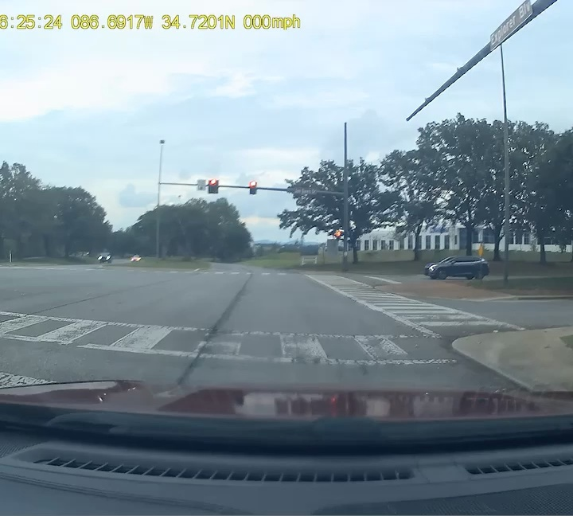
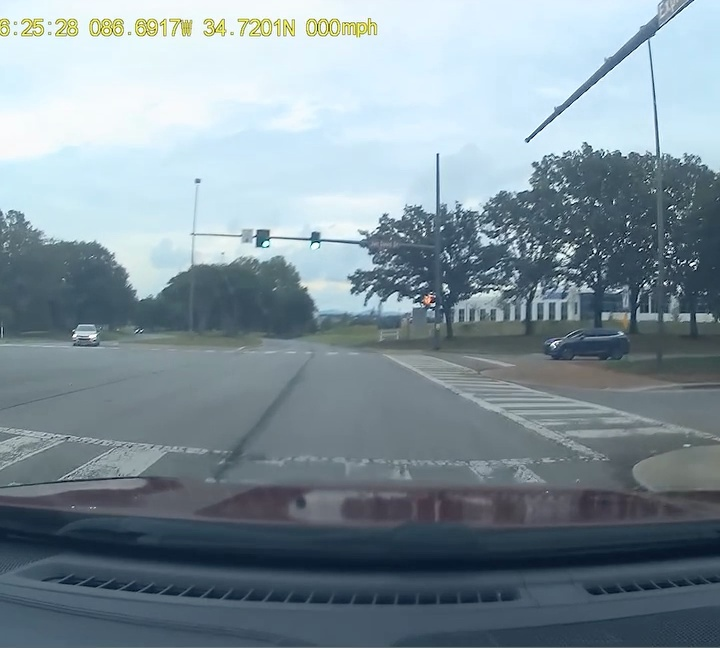
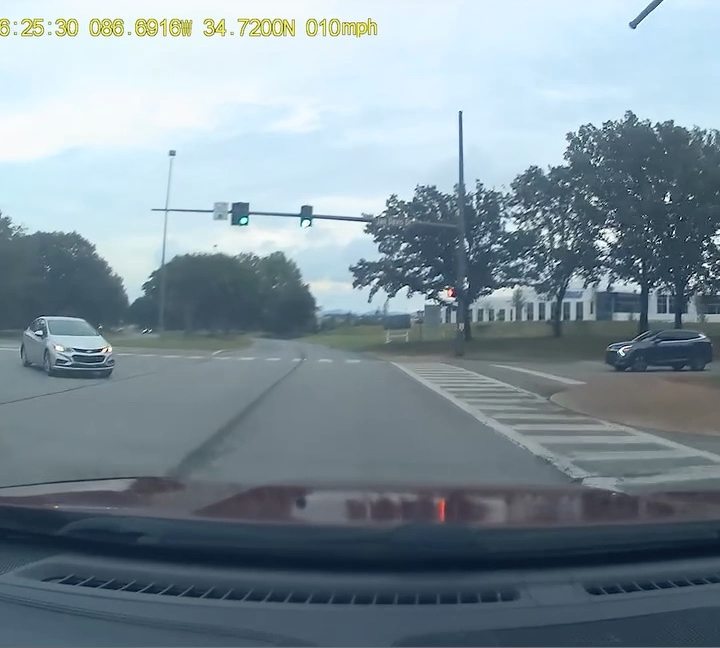
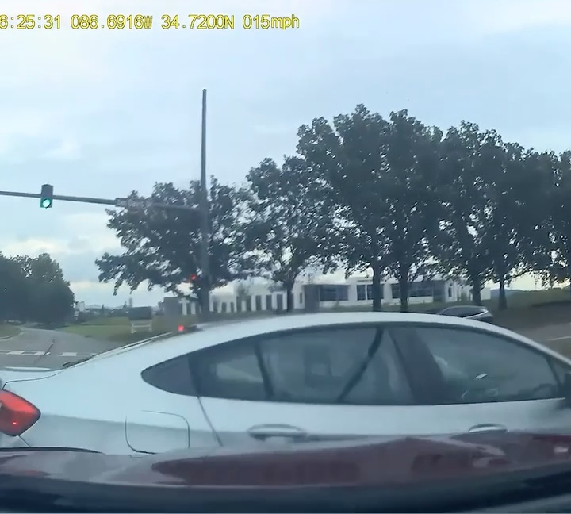
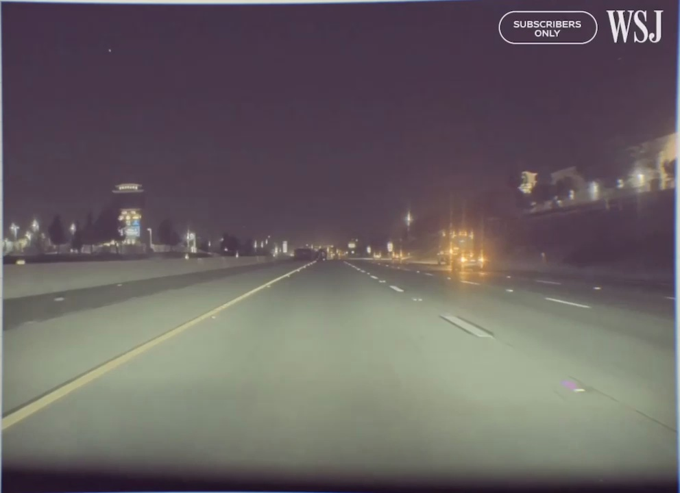
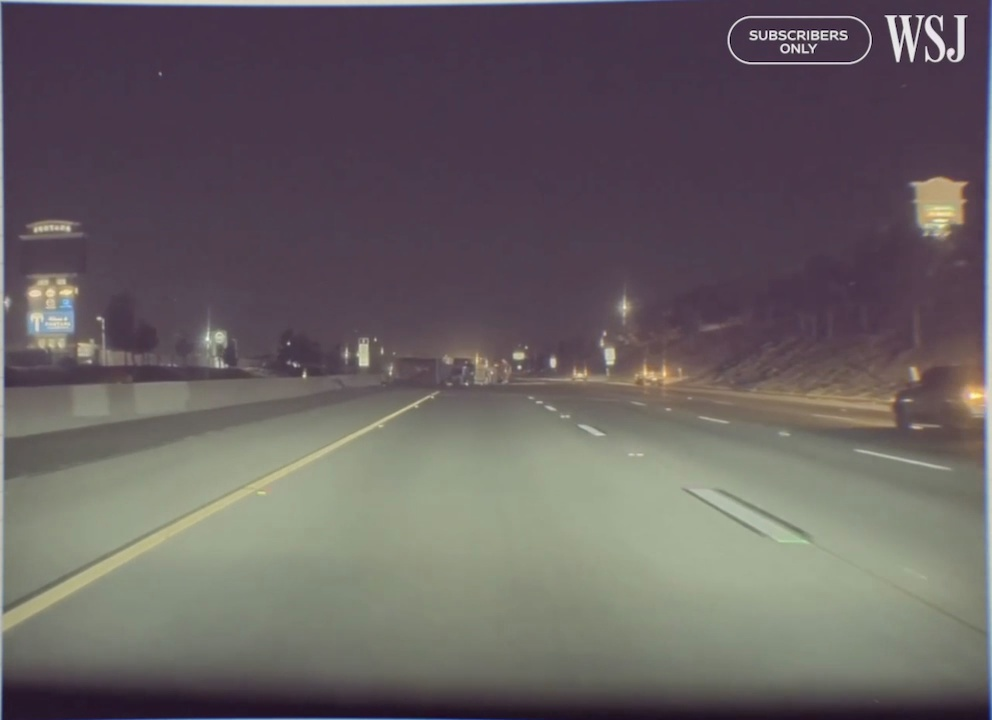
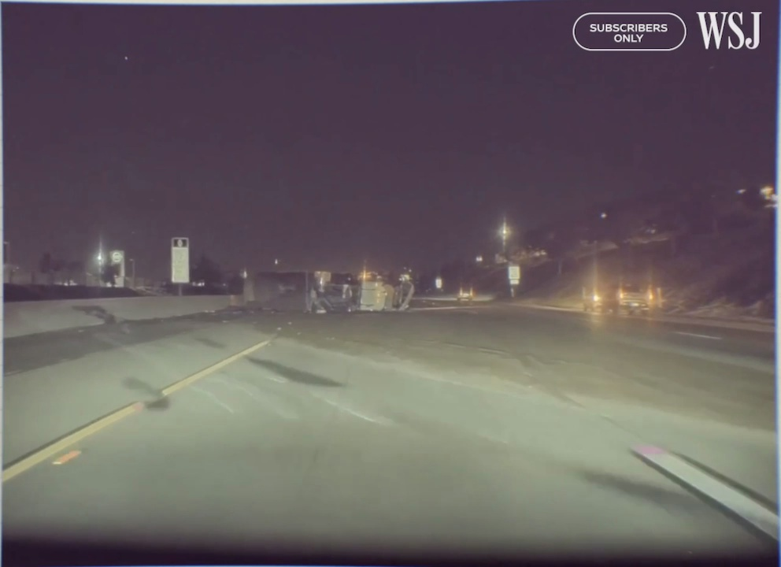
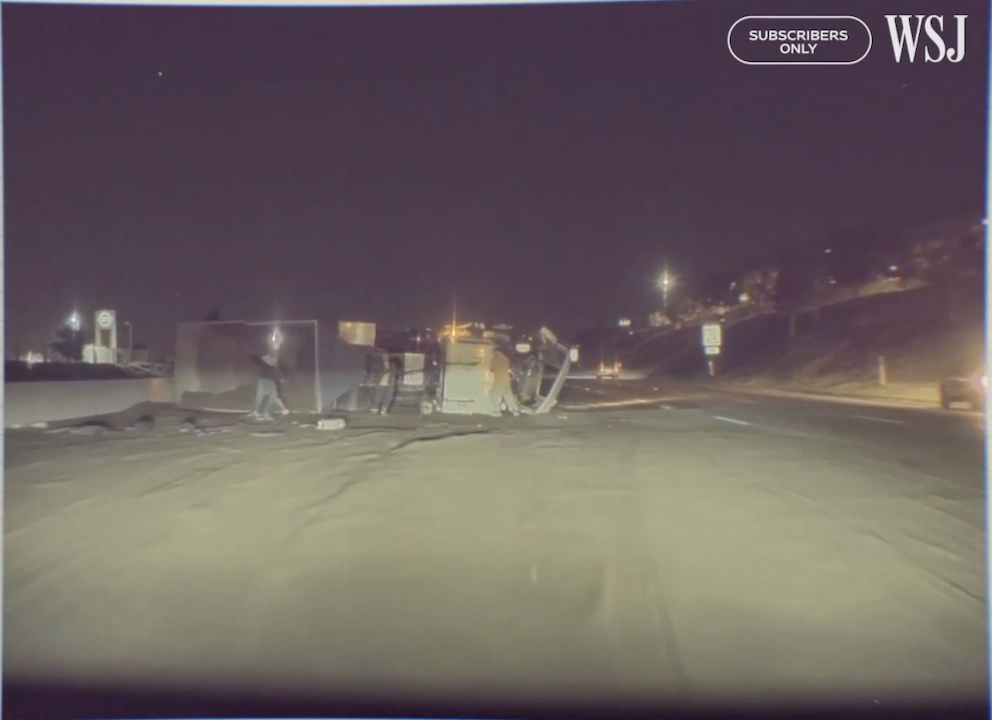

01 &nbsp;·&nbsp; The Problem

AV systems rely on DNNs that require constant retraining. When outdated, they fail to recognize novel crash scenarios, causing preventable accidents.

02 &nbsp;·&nbsp; The Approach

Real-world dashcam crash footage is decomposed frame-by-frame. LLaVA-7B and MoE-LLaVA predict the safest driving action at each frame: <strong style="color:#e2e8f0;">brake, accelerate, or turn</strong>.

03 &nbsp;·&nbsp; The Metric: CPE

<strong style="color:#e2e8f0;">Crash Prevention Efficiency</strong> scores how early and how precisely a model detects the threat, measured against the point of no return (tPNR) and crash point (tx).

<svg xmlns="http://www.w3.org/2000/svg" width="16" height="16" fill="none" viewBox="0 0 24 24" stroke="currentColor" stroke-width="1.8"><path stroke-linecap="round" stroke-linejoin="round" d="M3.75 13.5l10.5-11.25L12 10.5h8.25L9.75 21.75 12 13.5H3.75z"/></svg>

Frame-by-Frame VLM Analysis

MoE-LLaVA's real-time decision-making across two critical crash scenarios, from safe driving to the moment of impact.

Q1Can VLMs Overcome Human Drivers?

Red Light Violation·Dashcam · victim vehicle POV·VLMs detected threat <strong>1.33 s earlier</strong> than humans

<video class="vlm-video" autoplay muted loop playsinline style="width:100%;display:block;aspect-ratio:16/9;object-fit:cover;background:#000;"><source src="/files/publications/rlv-crash.mp4" type="video/mp4"></video>

t₀ · StarttR · DetectiontPNR · No Returntx · Crash

Safe Zone

MoE-LLaVA

"You are driving at 8 mph approaching a four-way intersection."

VLM Detects Threat

MoE-LLaVA

"A car is approaching a crosswalk – exercise caution at the intersection."

Point of No Return

MoE-LLaVA

"Slow down – maintain a safe distance from the white car in front of you."

Crash Point

MoE-LLaVA

"You should slow down immediately – the situation ahead is critical."

Q2Can VLMs Overcome DNN-Based AV Systems?

Flipped Truck · Highway at Night·Tesla dashcam footage·VLMs detected hazard <strong>before braking initiated</strong>

<video class="vlm-video" autoplay muted loop playsinline style="width:100%;display:block;aspect-ratio:16/9;object-fit:cover;background:#000;"><source src="/files/publications/av-crash.mp4" type="video/mp4"></video>

t₀ · StarttR · DetectiontPNR · No Returntx · Crash

Safe Zone

MoE-LLaVA

"You are driving at 57 mph on a dark highway at night – maintain safe following distance."

VLM Detects Threat

MoE-LLaVA

"Be aware of potential obstacles or traffic conditions ahead on the highway."

Point of No Return

MoE-LLaVA

"There is a truck on the road in a precarious position – slow down to avoid a collision."

Crash Point

MoE-LLaVA

"Brake immediately – there is an obstruction across the full width of the road."

<svg xmlns="http://www.w3.org/2000/svg" width="14" height="14" fill="none" viewBox="0 0 24 24" stroke="#6366f1" stroke-width="2" style="flex-shrink:0;margin-top:.15rem;"><path stroke-linecap="round" stroke-linejoin="round" d="M11.25 11.25l.041-.02a.75.75 0 011.063.852l-.708 2.836a.75.75 0 001.063.853l.041-.021M21 12a9 9 0 11-18 0 9 9 0 0118 0zm-9-3.75h.008v.008H12V8.25z"/></svg>
Timeline zones reflect each scenario's <strong style="color:#6366f1;">Crash Prevention Efficiency (CPE)</strong> intervals: the window between VLM detection (tR), the point of no return (tPNR), and impact (tx). Frames extracted from real-world dashcam footage used in the study.

∫

Crash Prevention Efficiency (CPE)

A novel metric measuring how early and precisely a model acts relative to the Point of No Return (tb).

Formula

CPE =

e&#8722;&#945;(tb&#8722;tc)EARLY &nbsp;&nbsp; if&nbsp; tc &lt; tb

1ON-TIME &nbsp;&nbsp; if&nbsp; tc = tb

&#8722;e&#8722;&#946;(tc&#8722;tb)LATE &nbsp;&nbsp; if&nbsp; tc &gt; tb

Variables

tb= d/v, Point of No Return timetc= td + tr, Detection + reaction time&#945;Scaling factor for early actions&#946;Scaling factor for late actions; &#946; &gt; &#945;

CPE vs. Detection Timing
<svg width="100%" viewBox="0 0 640 260" style="overflow:visible;" xmlns="http://www.w3.org/2000/svg"><defs><linearGradient id="egr" x1="0" y1="0" x2="1" y2="0"><stop offset="0%" stop-color="#dc2626" stop-opacity=".85"/><stop offset="40%" stop-color="#f97316" stop-opacity=".9"/><stop offset="72%" stop-color="#fbbf24"/><stop offset="100%" stop-color="#22c55e"/></linearGradient><linearGradient id="lgr" x1="0" y1="0" x2="1" y2="0"><stop offset="0%" stop-color="#22c55e"/><stop offset="28%" stop-color="#fbbf24"/><stop offset="60%" stop-color="#f97316" stop-opacity=".9"/><stop offset="100%" stop-color="#dc2626" stop-opacity=".85"/></linearGradient><marker id="axAr" markerWidth="7" markerHeight="5" refX="6" refY="2.5" orient="auto"><path d="M0,0 L7,2.5 L0,5 Z" fill="rgba(148,163,184,.5)"/></marker><marker id="axAu" markerWidth="5" markerHeight="7" refX="2.5" refY="0" orient="auto"><path d="M0,7 L2.5,0 L5,7 Z" fill="rgba(148,163,184,.5)"/></marker></defs><line x1="55" y1="140" x2="615" y2="140" stroke="rgba(148,163,184,.45)" stroke-width="1.5" marker-end="url(#axAr)"/><line x1="65" y1="252" x2="65" y2="12" stroke="rgba(148,163,184,.45)" stroke-width="1.5" marker-end="url(#axAu)"/><line x1="65" y1="42" x2="328" y2="42" stroke="rgba(148,163,184,.25)" stroke-width="1" stroke-dasharray="5,4"/><line x1="320" y1="42" x2="320" y2="140" stroke="rgba(148,163,184,.22)" stroke-width="1" stroke-dasharray="4,4"/><path d="M 60 236 C 215 236, 298 42, 320 42" stroke="url(#egr)" stroke-width="3" fill="none" stroke-linecap="round"/><path d="M 320 42 C 342 42, 425 236, 580 236" stroke="url(#lgr)" stroke-width="3" fill="none" stroke-linecap="round"/><circle cx="320" cy="42" r="5.5" fill="#22c55e" stroke="rgba(255,255,255,.3)" stroke-width="1"/><line x1="290" y1="82" x2="290" y2="140" stroke="rgba(129,140,248,.4)" stroke-width="1" stroke-dasharray="3,3"/><circle cx="290" cy="82" r="5.5" fill="#6366f1" stroke="rgba(255,255,255,.4)" stroke-width="1.2"/><text x="210" y="66" font-size="10" fill="#a5b4fc" text-anchor="middle" font-family="sans-serif">LLaVA-7B</text><text x="210" y="77" font-size="8.5" fill="rgba(165,180,252,.7)" text-anchor="middle" font-family="monospace">CPE&#8776;0.60</text><line x1="232" y1="71" x2="283" y2="80" stroke="rgba(129,140,248,.4)" stroke-width="1"/><circle cx="302" cy="76" r="5.5" fill="#a855f7" stroke="rgba(255,255,255,.4)" stroke-width="1.2"/><text x="420" y="36" font-size="10" fill="#c084fc" text-anchor="middle" font-family="sans-serif">MoE-LLaVA</text><text x="420" y="47" font-size="8.5" fill="rgba(192,132,252,.7)" text-anchor="middle" font-family="monospace">CPE&#8776;0.63</text><line x1="388" y1="41" x2="309" y2="73" stroke="rgba(192,132,252,.4)" stroke-width="1"/><circle cx="433" cy="148" r="5.5" fill="#ef4444" stroke="rgba(255,255,255,.4)" stroke-width="1.2"/><line x1="433" y1="140" x2="433" y2="148" stroke="rgba(239,68,68,.45)" stroke-width="1" stroke-dasharray="3,3"/><line x1="65" y1="148" x2="427" y2="148" stroke="rgba(239,68,68,.3)" stroke-width="1" stroke-dasharray="3,3"/><line x1="444" y1="152" x2="508" y2="168" stroke="rgba(239,68,68,.35)" stroke-width="1"/><text x="512" y="172" font-size="10" fill="#f87171" text-anchor="start" font-family="sans-serif">AV Systems</text><text x="512" y="183" font-size="8.5" fill="rgba(248,113,113,.7)" text-anchor="start" font-family="monospace">CPE&#8776;&#8722;0.07</text><text x="59" y="152" font-size="8" fill="rgba(248,113,113,.65)" text-anchor="end" font-family="monospace">&#8722;.07</text><text x="58" y="45" font-size="9.5" fill="rgba(148,163,184,.75)" text-anchor="end" font-family="monospace">1</text><text x="58" y="143" font-size="9.5" fill="rgba(148,163,184,.75)" text-anchor="end" font-family="monospace">0</text><text x="58" y="240" font-size="9.5" fill="rgba(148,163,184,.75)" text-anchor="end" font-family="monospace">&#8722;1</text><text x="40" y="17" font-size="11" fill="rgba(148,163,184,.75)" text-anchor="middle" font-family="monospace">CPE</text><text x="600" y="112" font-size="10.5" fill="rgba(148,163,184,.75)" text-anchor="end" font-family="monospace">Time(t)</text><text x="320" y="157" font-size="9" fill="rgba(148,163,184,.6)" text-anchor="middle" font-family="monospace">t&#8336; = t&#7495;</text><text x="185" y="130" font-size="11" fill="rgba(34,197,94,.6)" text-anchor="middle" font-family="sans-serif" font-style="italic">Early Action</text><text x="470" y="130" font-size="11" fill="rgba(239,68,68,.6)" text-anchor="middle" font-family="sans-serif" font-style="italic">Late Action</text></svg>

Score &amp; Interpretation

&#8722;1 &nbsp;very early+1 &nbsp;ideal&#8722;1 &nbsp;very late

Results highlight

LLaVA-7Bavg CPE0.42&ndash;0.82

MoE-LLaVAavg CPE0.40&ndash;0.85

AV Systemsavg CPE&#8722;0.13 to &#8722;0.002

